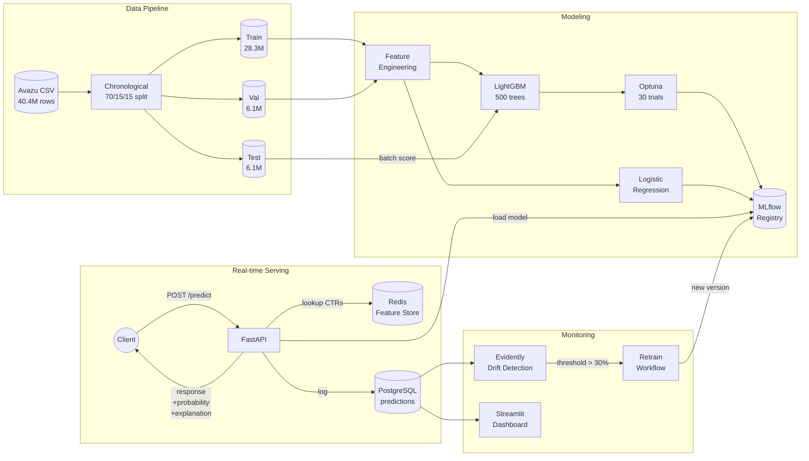

# Ad-Click Prediction

End-to-end CTR prediction system for digital ad inventory — from raw click logs through training, real-time serving, monitoring, and automated retraining.

Built around the [Avazu CTR](https://www.kaggle.com/datasets/atirpetkar/avazu-ctr) dataset (40.4M impressions, ~17% click rate). Holdout AUC on unseen data: **0.7326**.

---

## Architecture



---

## Model Performance

| Model | Training Data | Val AUC | Test AUC | LogLoss |
|---|---|---|---|---|
| Logistic Regression (baseline) | 3M sample | 0.6308 | — | 0.4059 |
| LightGBM (default params) | 5M sample | 0.7485 | — | 0.3692 |
| LightGBM (Optuna best) | 2M sample | 0.7483 | — | — |
| **LightGBM (production)** | **28.3M full** | **0.7540** | **0.7326** | **0.3668** |

Generalization gap (val → holdout): **0.021** — small and stable across the chronological split.

---

## Tech Stack

| Layer | Tool |
|---|---|
| **Modeling** | LightGBM, scikit-learn, Optuna |
| **Tracking & Registry** | MLflow 3.x (alias-based deployments) |
| **Serving** | FastAPI + uvicorn |
| **Feature Store** | Redis 7 |
| **Prediction Logging** | PostgreSQL 15 (JSONB payloads) |
| **Drift Detection** | Evidently 0.7+ |
| **Dashboard** | Streamlit + Plotly |
| **Data Versioning** | DVC pipeline |
| **Container** | Multi-stage Docker, non-root user |
| **CI/CD** | GitHub Actions (lint → test → build → retrain cron) |

---

## Repository Layout

```
src/
  data/         prepare.py            chronological train/val/test split
  features/     engineering.py        time + hash + label encoding + interactions
                store.py              Redis feature store with bulk_load
                populate_store.py     compute per-entity historical CTR
  models/       baseline.py           SGD logistic regression baseline
                train.py              LightGBM trainer + MLflow logger
                tune.py               Optuna hyperparameter search
                promote.py            set @production alias on a model version
                batch_score.py        offline scoring in chunks
                loader.py             shared model + encoders loader
  api/          main.py               FastAPI server with lifespan + bg logging
  monitoring/   logger.py             prediction logger to PostgreSQL
                drift.py              Evidently drift detection
                dashboard.py          Streamlit dashboard
tests/
  unit/         test_features.py      6 unit tests for feature pipeline
  integration/  test_api.py           4 integration tests with mocked deps
notebooks/
  01_eda.ipynb                        9-section EDA: imbalance, time, cardinality
docker/
  Dockerfile                          multi-stage build, non-root user, healthcheck
.github/workflows/
  ci.yml                              lint + test + build on every push
  retrain.yml                         weekly cron + manual + drift-gated
```

---

## Quickstart

### Prerequisites
- Python 3.11+
- Docker (Rancher Desktop / Docker Desktop)
- 16GB RAM recommended for full-data training

### One-time setup

```bash
git clone https://github.com/ManoVijay15/Ad-Click-Prediction.git
cd Ad-Click-Prediction

python3 -m venv .venv
source .venv/bin/activate
pip install -e ".[dev]"
```

### Get the data

```bash
# Requires Kaggle API credentials
kaggle competitions download -c avazu-ctr-prediction
unzip avazu-ctr-prediction.zip -d data/raw/
mv data/raw/train data/raw/train.csv
```

### Run the pipeline

```bash
# 1. Split into train/val/test (~5 min)
make populate-store              # also: python -m src.data.prepare

# 2. Start infrastructure
docker compose up -d postgres redis
make mlflow                      # in a separate terminal — local MLflow at :5000

# 3. Train the model on 5M sample (~4 min) and register it
.venv/bin/python -m src.models.train --register

# 4. Promote to @production alias
make promote

# 5. Populate Redis with per-entity historical CTRs
make populate-store

# 6. Start the prediction API
make serve                       # FastAPI on :8000

# 7. Open the monitoring dashboard
make dashboard                   # Streamlit on :8501
```

### Test the API

```bash
curl -X POST http://localhost:8000/predict \
  -H "Content-Type: application/json" \
  -d '{
    "hour": 14102108, "banner_pos": 1,
    "site_id": "d9750ee7", "site_domain": "98572c79", "site_category": "f028772b",
    "app_id": "ecad2386", "app_domain": "7801e8d9", "app_category": "07d7df22",
    "device_id": "a99f214a", "device_ip": "ce9525d3", "device_model": "711ee120",
    "device_type": 1, "C1": 1005, "C14": 17614, "C15": 320, "C16": 50,
    "C17": 1993, "C18": 2, "C19": 1063, "C20": -1, "C21": 33
  }'
```

Response:
```json
{
  "click_probability": 0.443,
  "will_click": false,
  "threshold": 0.5,
  "model_version": "1",
  "cached_features": {
    "site_ctr_7d": 0.286, "site_impr_7d": 129984,
    "app_ctr_7d": 0.203, "app_impr_7d": 3288205,
    "device_ctr_7d": 0.178, "device_impr_7d": 4122089
  }
}
```

---

## Key Design Decisions

### Why LightGBM over deep learning
At 40M rows of mostly categorical features, gradient boosting beats DeepFM/Wide & Deep on training time and serves predictions in ~1ms vs ~5ms. The 0.7540 AUC is competitive with deep models published on Avazu.

### Why hash encoding (not one-hot or embeddings)
`device_ip` has 915k unique values, `device_id` has 275k. One-hot encoding produces a 1.2M-dim sparse vector per row. Hash encoding to 2^18 buckets (262k) gives ~99% accuracy of one-hot at <1% the memory.

### Why chronological train/val/test split (not random)
Random splits on time-ordered data leak future information into training. Avazu spans 11 days; the chronological 70/15/15 split mirrors how a model is actually deployed (train on history, predict on tomorrow). The val/test AUC drop confirms this is harder but realistic.

### Why deterministic hashing
Python's built-in `hash()` is salt-randomized per process. A row that hashed to bucket 12345 during training would hash to a different bucket at serving time → broken predictions. Switched to `pd.util.hash_pandas_object` (xxhash with fixed seed). This bug took test AUC from 0.5689 → 0.7326 once fixed.

### Why MLflow aliases (not stages)
MLflow 3.x deprecated stages (`Production`, `Staging`). Aliases (`@production`, `@shadow`) are more flexible — you can have multiple models at multiple aliases, and shadow deployments are trivial.

### Why a feature store on top of LightGBM
The Redis store doesn't replace model features — it augments responses with **business signals** (historical CTR per site/app/device) that downstream consumers can use for bidding decisions. The model gives `click_probability`, the cached features give context for "why".

---

## Failure Modes & Resilience

| Component down | Behavior |
|---|---|
| Redis | Predictions still served; `cached_features: null` |
| PostgreSQL | Predictions still served; logger silently disabled |
| MLflow Registry | API fails to start with clear error (cannot load model) |
| Drift signal | Retrain workflow uses default fallback (always retrain weekly) |

The system follows **graceful degradation** — core inference path never blocks on auxiliary services.

---

## CI/CD

| Workflow | Trigger | Steps |
|---|---|---|
| `ci.yml` | Push to `main`/`dev`, PRs | ruff lint → unit tests → integration tests → multi-stage Docker build (with buildx cache) |
| `retrain.yml` | Weekly cron (Mon 03:00 UTC) + manual | drift-gate → train → register → promote (placeholder for `dvc pull` in production) |

10/10 tests pass locally; CI runs the same suite on every push.

---

## What's Next

| Tier | Enhancement |
|---|---|
| ML | Probability calibration (Platt/isotonic), SHAP per-prediction explanations, time-series CV |
| Production | asyncpg + connection pooling, Prometheus `/metrics`, JWT auth, rate limiting |
| MLOps | Shadow-mode deployments, A/B testing harness, backtest framework, model cards |
| Data | Schema validation (Great Expectations), feature versioning, streaming ingestion |

---

## License

MIT
